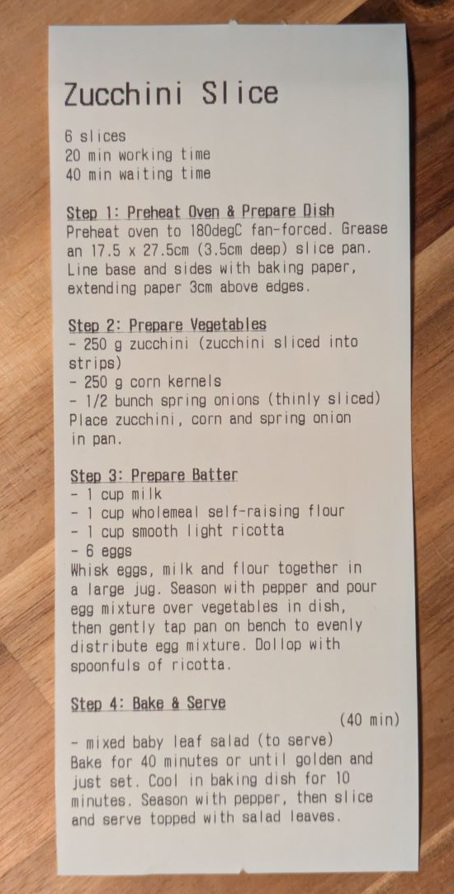

# Receipt Recipe Printer for Tandoor

This is a basic CLI app that pulls recipes from an instance of [Tandoor Recipes](https://docs.tandoor.dev/) and prints it on an ESC/POS compatible printer.



## Why?
Mainly for fun :)

It does have a few benefits over Tandoor's native printing output:
- Space (the image tends to be very large)
- Entertainment value
- Single piece of paper - no more shuffling papers or flipping over to follow instructions.

## Usage
Binaries for Linux can be downloaded from the releases tab. 

Generally, you will want to invoke the application as such:

```
recipe_printer --username <tandoor username> --password <tandoor password> https://my.tandoor.instance <recipe ID>
```

Replacing username, password, instance URL and recipe ID. The recipe ID can be found at the end of the URL when viewing a recipe in Tandoor. 

If preferred, the `--token` option can be used instead of the username/password combination, if you have a valid token.

Parameters can always be found by using the `--help` flag.

## Compatibility

### Hardware
The application has only been tested against a Partner RP-320 printer. It is expected that the application works on other USB-connected ESC/POS-compatible printers. Serial/parallel printers may work, given the correct path (using the `--printer-path` flag). Networked printers are not supported - I do not have one to test. 

### Software
I've only tested on Fedora and Debian machines. Most Linux distributions should work, given that drivers for receipt printers are installed. Other Unix-like OSes have not been tested and Windows is not a target. 

### Recipes
The printed information for each recipe is only title, instructions and ingredients. Other information, such as nutrition, servings or time are not printed. 

Whilst the application has worked against the recipes I have tested, I haven't tested it against any of Tandoor's more advanced features such as sub-recipes.

## Building

This application is built with cargo. Simply run `cargo build` to receive a binary.

## Known Issues
- Special characters such as the degrees symbol are not handled correctly
- Plural unit names are not handled
- All ingredient quantities are printed to one decimal place

## License
Affero GPL 3.0
